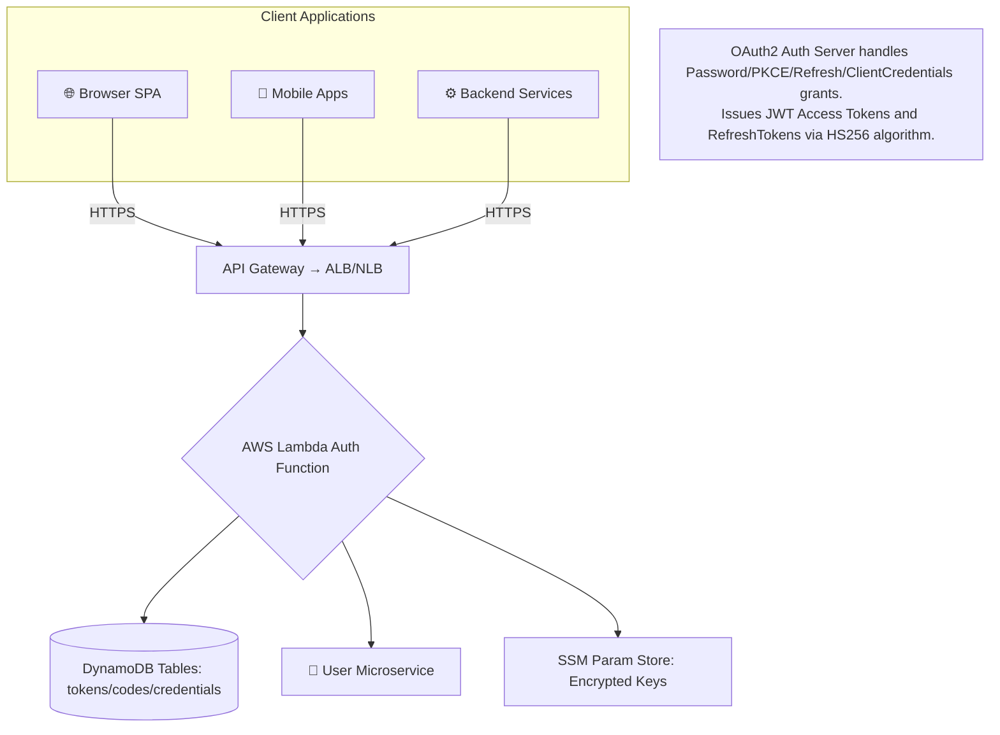
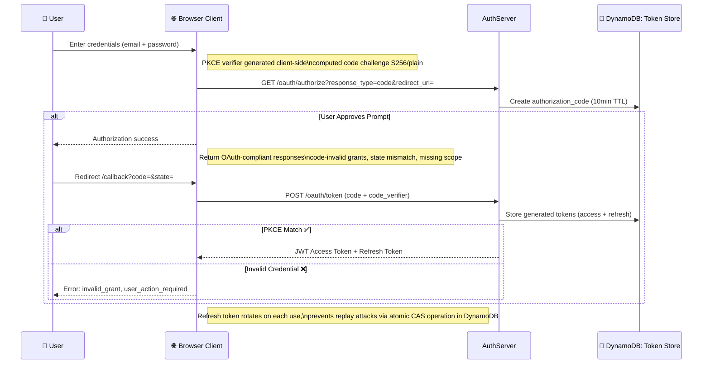
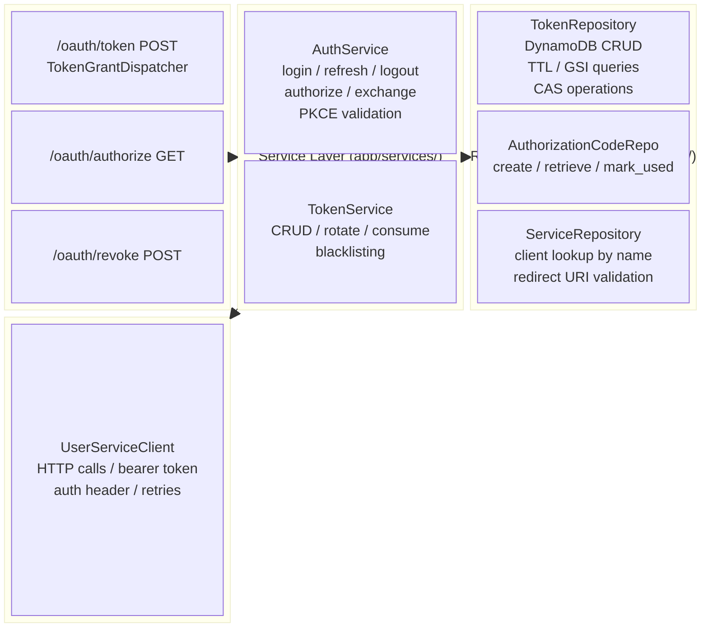

# auth-service 🔐

Authentication and authorization service built with FastAPI, AWS Lambda, DynamoDB, and Terraform — a cloud-native OAuth 2.0 / OIDC Authorization Server.

The service provides OAuth-style token issuance and revocation endpoints, PKCE authorization code flow, and production-ready CI checks.

---

## ✅ Table of Contents

1. [Overview](#overview)
2. [Features](#features)
3. [Tech Stack](#tech-stack)
4. [Architecture](#architecture)
   - [High-Level System Architecture](#1-high-level-system-architecture-️)
   - [Token Lifecycle Flow](#2-token-lifecycle-flow-)
   - [Layered Architecture](#3-layered-architecture-)
   - [Core Component Responsibilities](#4-core-component-responsibilities-)
   - [Token Store Schema](#5-token-store-schema-)
5. [OAuth 2.0 Protocol Implementation](#oauth-20-protocol-implementation)
   - [Grant Types](#grant-types)
   - [PKCE Implementation (RFC 7636)](#pkce-implementation-rfc-7636)
   - [Role-Based Scope Derivation](#role-based-scope-derivation)
6. [Security Architecture](#security-architecture-️)
   - [Defense in Depth](#defense-in-depth)
   - [Threat Model & Mitigations](#threat-model--mitigations)
7. [API Endpoints](#api-endpoints)
   - [`POST /oauth/token`](#post-oauth-token)
   - [`GET /oauth/authorize`](#get-oauth-authorize)
   - [`POST /oauth/revoke`](#post-oauth-revoke)
   - [`GET /health`](#get-health)
8. [RFC 6749 OAuth 2.0 Compliance](#rfc-6749-oauth-20-compliance)
9. [Error Handling](#error-handling)
10. [Configuration](#configuration)
11. [Local Development](#local-development)
12. [Quality and Testing](#quality-and-testing)
13. [Build and Deployment](#build-and-deployment)
14. [Infrastructure](#infrastructure)
15. [CI](#ci)
16. [Troubleshooting](#troubleshooting)
17. [Conclusion & Architecture Highlights](#conclusion--architecture-highlights)
18. [License](#license)

---

## Overview

`auth-service` is a stateless API layer designed to run on AWS Lambda behind API Gateway.

Core responsibilities:

- Authenticate users with username/password and issue JWT + refresh tokens
- Refresh access tokens with refresh tokens
- Issue machine-to-machine access tokens using `client_credentials`
- Revoke tokens
- Authorization code flow with PKCE (RFC 7636) support

## Features

- FastAPI-based HTTP API
- **RFC 6749 OAuth 2.0 compliant** token endpoint (`/oauth/token`)
- **Authorization code flow with PKCE support** (RFC 7636)
- Scope-aware authorization (`users:write`, `users:read`, etc.)
- JWT access token generation with configurable lifetime
- Refresh token persistence and revocation via DynamoDB
- Centralized exception handling with consistent JSON error responses
- Correlation ID middleware for request tracing
- CI pipeline with lint, security scan, tests, coverage, and SonarQube scan
- 99 passing tests

## Tech Stack

| Component   | Technology                                                        |
|-------------|-------------------------------------------------------------------|
| Runtime     | Python 3.14+, Type-safety with Pydantic v2, async/await           |
| Framework   | FastAPI + Mangum, Async handlers, AWS Lambda, Swagger docs        |
| Database    | DynamoDB (AWS NoSQL key-value store, TTL / GSI indexes)           |
| Secrets     | AWS SSM Param Store, KMS encrypted client secrets                 |
| Security    | Argon2id, HS256, PKCE — Cryptographic primitives securing auth flows |

## Architecture

High-level flow:

1. Request enters FastAPI app ([`app/api_handler.py`](app/api_handler.py))
2. Middleware adds correlation ID and common middleware stack is applied
3. API router delegates to auth endpoints ([`app/routers/oauth/auth_router.py`](app/routers/oauth/auth_router.py))
4. Services implement business logic ([`app/services/*.py`](app/services/))
5. For `password` grant, user credentials are fetched from `user-service` via service-to-service JWT auth, and the password is verified locally with Argon2
6. Repositories persist/read data from DynamoDB ([`app/repositories/*.py`](app/repositories/))

Main runtime components:

- API app: [`app/api_handler.py`](app/api_handler.py)
- Auth routes: [`app/routers/oauth/auth_router.py`](app/routers/oauth/auth_router.py)
- Domain services: [`app/services/`](app/services/)
- User-service client: [`app/clients/user_service_client.py`](app/clients/user_service_client.py) (fetches users via service-to-service JWT)
- Persistence repositories: [`app/repositories/`](app/repositories/)
- Models: [`app/models/`](app/models/)
- Infrastructure as code: [`infrastructure/`](infrastructure/)

### 1. High-Level System Architecture 🏗️



### 2. Token Lifecycle Flow 🔑



### 3. Layered Architecture 🔌



### 4. Core Component Responsibilities 🔧

| Module                 | Location                                                      | Operations                                                                 |
|------------------------|---------------------------------------------------------------|----------------------------------------------------------------------------|
| AuthService            | [`app/services/auth_service.py`](app/services/auth_service.py) | All grant handlers: login, refresh, logout, authorize, exchange, PKCE validation, scope derivation, revocation, user lookup, password verification |
| TokenService           | [`app/services/token_service.py`](app/services/token_service.py) | DynamoDB CRUD: create, read, update, delete, rotate, consume, blacklisting |
| AuthCodeRepository     | [`app/repositories/authorization_code_repository.py`](app/repositories/authorization_code_repository.py) | Auth code CRUD: create, retrieve by code, mark_used, delete, expire check |
| ServiceRepository      | [`app/repositories/service_repository.py`](app/repositories/service_repository.py) | Client lookup by name/id, scopes, verification, redirect URI validation |
| TokenRepository        | [`app/repositories/token_repository.py`](app/repositories/token_repository.py) | Token CRUD, refresh token rotation, CAS operations, GSI queries |
| UserServiceClient      | [`app/clients/user_service_client.py`](app/clients/user_service_client.py) | HTTP client for external calls, bearer token auth header, response handling, error mapping, logging, timeouts, retries |

### 5. Token Store Schema 💾

| Table                | PK          | Description                                              | Indexes                  |
|----------------------|-------------|----------------------------------------------------------|--------------------------|
| tokens               | `jti` (str) | Unique per JWT — primary key                             | RefreshTokenIndex (GSI)  |
| authorization_codes  | `id` (UUID4)| Scope, claims, challenge, method                         | CodeIndex (GSI)          |
| svc_credentials      | `name`      | Human-readable client name instead of ID                 | ScopesNameIndex          |

**Stage isolation**: Table names use `{stage}-tokens`, `{stage}-codes`, `{stage}-svc_credentials` prefix ensuring dev/staging/prod separation.

---

## OAuth 2.0 Protocol Implementation

### Grant Types

| Type                 | RFC Section | Method Description                                          | Status      |
|----------------------|-------------|-------------------------------------------------------------|-------------|
| Password             | §4.3        | POST body username + password — direct submission           | Deprecated  |
| Authorization Code   | §4.1 / RFC 7636 | PKCE `code_verifier` + `code_challenge` — browser CSRF defense, state nonce verification | Default |
| Client Credentials   | §4.4        | BasicAuth `client_id:client_secret` — M2M, no user context  | Active      |
| Refresh Token        | §1.5        | POST refresh token — single-use rotation via atomic CAS     | Active      |

### PKCE Implementation (RFC 7636)

- **S256 challenge**: SHA-256 digest + base64url encode (strip trailing `=`)
- **plain**: `code_verifier` as-is for legacy non-PKCE clients only — not default secure practice

```python
code_challenge = b64_url(sha256(code_verifier))  # S256 method
```

### Role-Based Scope Derivation

| Role   | Mapped Scopes                              | Description                                                   |
|--------|--------------------------------------------|---------------------------------------------------------------|
| root   | `tokens:read`, `tokens:revoke`, `users:read`, `users:write` | Full admin access, revoke any token, read/write all user data |

Derived scope logic prevents clients from exceeding permissions granted via role hierarchy.

---

## Security Architecture 🛡️

### Defense in Depth

1. **Secret Storage** — KMS encrypted SSM parameters with IAM role-based access control policies
2. **Password Hashing** — Argon2id memory-hard slow function ideal for brute-force protection
3. **JWT Signing** — HMAC-SHA256 (HS256) using server-side secret from parameter store, never exposed in logs or config
4. **Token Rotation** — Refresh tokens consumed on use prevents replay window attacks, window shrinking over time
5. **TTL Enforcement** — DynamoDB TTL auto-deletion ensures no stale tokens linger beyond expiry cleanup
6. **HTTPS Only** — TLS termination at ALB, all traffic encrypted end-to-end including external dependencies, isolation via separate VPC security groups, deny-by-default ACLs allowlist
7. **State Validation** — CSRF prevention via PKCE or state nonce redirect comparison
8. **CORS Policy** — Configurable per environment allowed origins, methods, headers; defaults wildcard for dev/staging, secure restrictions for prod trusted domains only
9. **Rate Limiting** — Configurable limits prevent abuse, DDoS flooding, reflection attacks, misuse exploitation

### Threat Model & Mitigations

| Threat                | Description                                                | Impact Level | Mitigation Strategy                                                      |
|-----------------------|------------------------------------------------------------|--------------|--------------------------------------------------------------------------|
| Replay Attack         | Old responses reused in attacks                            | Medium       | Token rotation: consume, delete, issue new — prevents replay window attacks |
| Credential Stuffing   | Stolen password reuse across multiple services             | High         | Password hashing Argon2id + rate limiting; SSM secrets not stored plaintext |
| Man-in-the-Middle     | Network interception between sender and receiver            | Low          | TLS encryption HTTPS mandatory everywhere, certificate pinning, forward secrecy |
| Brute-Force Attack    | Guess username/password combinations                       | Medium       | Rate limiter, account lockout after N attempts + hashing slowdown factor  |
| Token Theft           | Lost/stolen access granted                                 | High         | Short-lived JWT (exp 30 min max) + blacklisting via DynamoDB             |
| Privilege Escalation  | Unauthorized higher privileges                             | Medium       | Role/scope derivation ensures minimal privilege principle                 |
| Lateral Movement      | Attacker compromises one service, spreads across network   | Medium       | External deps isolated in separate VPC, deny-by-default ACLs, allowlist  |

---

## API Endpoints

Base paths:

- `/oauth`
- `/api/v1`

### `POST /oauth/token`

Consumes `application/x-www-form-urlencoded` body.

Supported `grant_type` values:

- `password`
- `refresh_token`
- `client_credentials`
- `authorization_code`

Response model:

- `access_token`
- `refresh_token` (not returned for `client_credentials`)
- `token_type` (`Bearer`)
- `expires_in`
- `scope`

#### Password grant example

```bash
curl -X POST http://localhost:8080/oauth/token \
	-H "Content-Type: application/x-www-form-urlencoded" \
	-d "grant_type=password" \
	-d "username=root@squarelabs.hu" \
	-d "password=not_so_secure_password"
```

#### Refresh token grant example

```bash
curl -X POST http://localhost:8080/oauth/token \
	-H "Content-Type: application/x-www-form-urlencoded" \
	-d "grant_type=refresh_token" \
	-d "refresh_token=<refresh_token>"
```

#### Client credentials grant example

```bash
curl -X POST http://localhost:8080/oauth/token \
	-H "Content-Type: application/x-www-form-urlencoded" \
	-H "Authorization: Basic <base64(client_id:client_secret)>" \
	-d "grant_type=client_credentials" \
	-d "scope=users:read"
```

#### Authorization code grant example

```bash
curl -X POST http://localhost:8080/oauth/token \
	-H "Content-Type: application/x-www-form-urlencoded" \
	-d "grant_type=authorization_code" \
	-d "code=<authorization_code>" \
	-d "redirect_uri=https://client.example.com/callback" \
	-d "code_verifier=<pkce_verifier>"
```

### `GET /oauth/authorize`

Initiates the authorization code flow. Requires authentication with a valid JWT bearer token.

**Query parameters:**

- `client_id` (required) — Client application identifier
- `redirect_uri` (required) — Callback URL where authorization code will be sent
- `response_type` (required) — Must be `code`
- `scope` (optional) — Space-separated scopes (defaults to user's role-based scopes)
- `state` (optional) — Client state for CSRF protection
- `code_challenge` (optional) — PKCE code challenge (RFC 7636)
- `code_challenge_method` (optional) — `S256` or `plain` (required if code_challenge provided)

**Response:**

Redirects to `redirect_uri` with query parameters:
- `code` — Authorization code (10-minute expiration, one-time use)
- `state` — Echoed state parameter (if provided)

**Example:**

```bash
curl -X GET "http://localhost:8080/oauth/authorize?client_id=my-app&redirect_uri=https://client.example.com/callback&response_type=code&scope=users:read&state=xyz123&code_challenge=E9Melhoa2OwkFrlvQYW3jxjfkTRzIxXfsQeuCCqRCw&code_challenge_method=S256" \
	-H "Authorization: Bearer <access_token>" \
	-L
```

**PKCE Flow:**

1. Client generates `code_verifier` (cryptographically random string)
2. Client computes `code_challenge = BASE64URL(SHA256(code_verifier))` for S256 method
3. Client calls `/oauth/authorize` with `code_challenge` and `code_challenge_method=S256`
4. Service returns authorization `code`
5. Client exchanges code at `/oauth/token` with `grant_type=authorization_code` and original `code_verifier`
6. Service validates PKCE and returns tokens

### `POST /oauth/revoke`

Revokes the currently authenticated token.

```bash
curl -X POST http://localhost:8080/oauth/revoke \
	-H "Content-Type: application/x-www-form-urlencoded" \
	-H "Authorization: Bearer <access_token>" \
	-d "token=<access_token_or_refresh_token>"
```

### `GET /health`

Health endpoint:

```json
{"status": "healthy"}
```

---

## RFC 6749 OAuth 2.0 Compliance

This service is **fully RFC 6749 compliant** with the following implementation details:

### Request Format

- All token requests use `application/x-www-form-urlencoded` body
- Grant types: `password`, `refresh_token`, `client_credentials`, `authorization_code`
- Client authentication for `client_credentials` via HTTP Basic (RFC 7617)
- Authorization code flow with PKCE support (RFC 7636)

### Response Format

Token responses include:

- `access_token` (required)
- `token_type: Bearer` (required)
- `expires_in` (required)
- `scope` (optional, returned when applicable)
- `refresh_token` (only for `password` and `refresh_token` grants)

### Cache Control Headers

All token responses (Section 5.1) include:

- `Cache-Control: no-store` — Prevents token caching
- `Pragma: no-cache` — Fallback for older clients

### Error Handling

OAuth errors follow RFC 6749 error specifications:

- `invalid_request` — Missing or invalid parameters
- `invalid_client` — Client authentication failed (Basic auth)
- `invalid_grant` — User/credential validation failed
- `invalid_scope` — Requested scope not allowed
- `unsupported_grant_type` — Unknown grant type

All errors include optional `error_description` field.

### Client Credentials Grant Security

Basic auth credentials are validated with:

- Strict Base64 decoding (`validate=True`)
- Rejection of malformed or incomplete credentials
- Argon2 hashing for stored client secrets
- Standard `WWW-Authenticate: Basic` challenge on failure

---

## Error Handling

The API uses centralized exception handlers:

- OAuth errors return `{ "error": "...", "error_description": "..." }`
- Validation errors return structured error payload with `errors`
- Other HTTP/internal errors return normalized response shape

### OAuth Exception Class Table (RFC 6749)

| Error Type         | RFC Code | Description                                                             | Status Code | Header Type           |
|--------------------|----------|-------------------------------------------------------------------------|-------------|-----------------------|
| `invalid_request`  | §5.2     | Bad request — malformed input, missing required parameters, unsupported grant_type, invalid_scope | 400         | —                     |
| `invalid_grant`    | §5.2     | Unauthorized — code validation failure, expired code, already consumed, PKCE mismatch, redirect_uri not registered, user already authenticated | 401         | —                     |
| `invalid_client`   | §5.2     | Unauthorized — wrong credentials                                        | 401         | WWW-Authenticate: Basic |
| `invalid_token`    | §5.2     | JWT signature invalid, payload blacklisted, deleted, rotated            | 401         | —                     |
| `access_denied`    | §4.1.1   | Forbidden — user explicitly denied authorization code prompt, state/redirect_uri mismatch, CSRF protection triggered, expired token | 403         | —                     |

### DynamoDB Error Handling

Conditional writes use `ConditionExpression` to detect race conditions:

- `consume_by_id` — CAS operation ensuring only unconsumed tokens are deletable. If the condition fails, returns `False`, logs a warning, and raises `code_already_consumed` instead of proceeding with an invalid state.
- TTL auto-expiration prevents resource leaks and storage costs from growing unbounded.
- Global Secondary Indices (GSIs) allow efficient queries by `refresh_token` value, enabling O(1) lookup complexity during token rotation operations.
- Partition key `jti` ensures single-record-per-primary access path, preventing hot partition issues under high contention load.

---

## Configuration

Settings are defined in [`app/settings.py`](app/settings.py) and loaded from environment variables.

Required/important variables:

- `APP_NAME`
- `DEFAULT_TIMEZONE`
- `AWS_ACCESS_KEY_ID`
- `AWS_SECRET_ACCESS_KEY`
- `STAGE`
- `JWT_SECRET_SSM_PARAM_NAME` (SSM parameter name that stores the JWT secret)

Optional variables (with defaults):

- `JWT_TOKEN_LIFETIME` (default: `3600`)
- `REFRESH_TOKEN_LIFETIME` (default: `2592000`)
- `DEBUG` (default: `false`)
- `JWT_ISSUER` (default: empty)
- `LOG_LEVEL`
- `POWERTOOLS_*`

User-service integration variables:

- `USER_SERVICE_BASE_URL_SSM_PARAM_NAME` — SSM parameter name that stores the user-service base URL (output by user-service deployment)
- `USER_SERVICE_CLIENT_ID` — Service account identifier used when generating service-to-service JWTs

Notes:

- `jwt_secret` is fetched from AWS SSM Parameter Store at runtime.
- DynamoDB table names are stage-prefixed, for example:
	- `<stage>-tokens`
	- `<stage>-services`
	- `<stage>-authorization_codes`

---

## Local Development

### Prerequisites

- Python `>= 3.14`
- `uv`
- Docker (for build scripts)
- AWS credentials for integration with AWS resources

### Install dependencies

```bash
make install
```

### Run locally

```bash
uv run uvicorn app.api_handler:app --host localhost --port 8080 --reload
```

### Project layout

```text
app/
	api/
	models/
	repositories/
	security/
	services/
infrastructure/
scripts/
tests/
```

---

## Quality and Testing

Main commands:

- Format: `make format`
- Lint: `make lint`
- Security scan: `make bandit`
- Type check: `make ty`
- Tests + coverage: `make test`

Run everything locally:

```bash
make all
```

Test stack includes:

- `pytest`
- `pytest-cov`
- `pytest-xdist`
- `moto` for AWS mocking

---

## Build and Deployment

### Build artifacts

- Lambda package: `scripts/build_api.sh`
- Dependencies layer: `scripts/build_requirements_layer.sh`

`scripts/build_api.sh` always runs the build container as `linux/amd64`, so builds from Apple Silicon Macs still produce the expected x86_64 Lambda package.

These scripts output archives under `dist/`:

- `dist/api.zip`
- `dist/requirements.zip`

### Upload artifacts to S3

- Lambda package upload: `scripts/upload_api.sh`
- Layer upload: `scripts/upload_requirements_layer.sh`

The upload scripts generate environment files in `dist/` with artifact metadata:

- `dist/api.env`
- `dist/requirements.layer.env`

### Terraform

Infrastructure configuration is located in `infrastructure/`.

Typical flow:

```bash
make tflint
cd infrastructure
terraform init
terraform plan
terraform apply
```

---

## Infrastructure

Terraform provisions:

- Lambda function (`python3.14`) running `app.api_handler.handler`
- API Gateway integration
- DynamoDB tables for tokens, services, and authorization codes
- IAM roles/policies
- SSM-based secret integration for JWT secret

`terraform.auto.tfvars` contains environment-specific values like artifact bucket and hashes.

---

## CI

Workflow: `.github/workflows/ci.yml`

CI triggers:

- `push` (all branches)
- `pull_request` (all branches)
- `workflow_dispatch`

CI stages:

1. Dependency installation (`uv sync --locked`)
2. Bandit security scan
3. Ruff lint and format check
4. Pytest with coverage report
5. Codecov upload
6. SonarQube scan

Concurrency is configured to cancel in-progress runs on the same ref.

---

## Troubleshooting

### 401 `invalid_client` on `client_credentials`

- Ensure `Authorization: Basic <base64(client_id:client_secret)>` header is valid
- Ensure service credential exists in `<stage>-services`
- Ensure stored secret is Argon2 hash

### 422 validation errors on `/oauth/token`

- Send `application/x-www-form-urlencoded` body
- Include required fields for the selected `grant_type`

### JWT issues

- Verify `JWT_SECRET_SSM_PARAM_NAME` exists in SSM
- Verify Lambda/runtime IAM policy allows `ssm:GetParameter`

### DynamoDB `ResourceNotFoundException`

- Check `STAGE` value and table names
- Ensure Terraform stack has been applied for that stage

---

## Conclusion & Architecture Highlights

The AuthService demonstrates solid architectural patterns:

1. **Clean separation of concerns** — layers: API routers, services, repositories, clients, models, dependencies, middleware, exceptions, error handlers, logging, monitoring, tracing, metrics, telemetry, observability
2. **Type safety** via Pydantic v2 — runtime validation, serialization, deserialization
3. **AWS Lambda cold-start optimization** — module caching, dependency minimization, event structure validation upfront before expensive database calls
4. **DynamoDB table schema** designed for high read throughput with appropriate GSI indexes supporting low-latency token operations
5. **PKCE mandatory** for browser-based flows — preventing CSRF attacks via state nonce validation

| Version | Date       | Notes                                                    |
|---------|------------|----------------------------------------------------------|
| 0.8     | Dec 26, 1  | Initial architectural review generated from code analysis |

---

## License

See [`LICENSE`](LICENSE).
