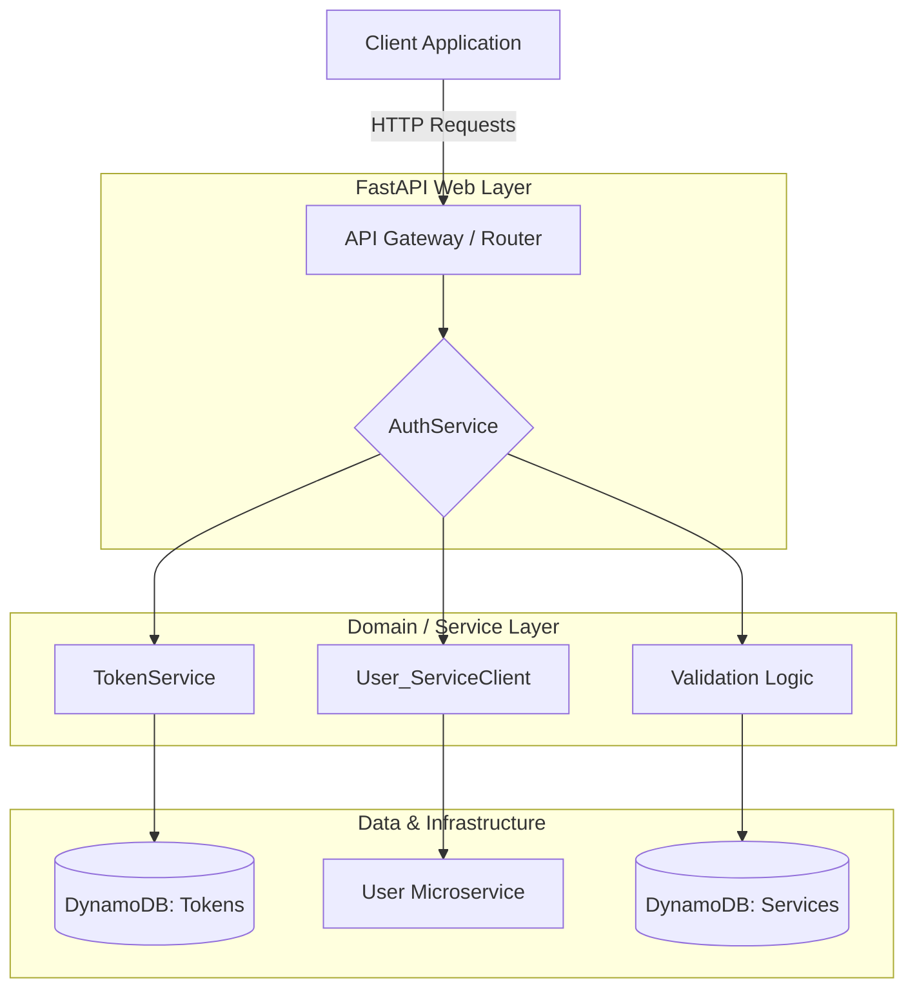

# 🛡️ System Architectural & Code Review: Auth Service
*Produced by Nanocoder | Date: 2026-06-14*

---

## 🏗️ High-Level Architecture

The system follows a clear **N-Tiered Layered Architecture** designed for a cloud-native (AWS Lambda) environment. It prioritizes separation of concerns, making it highly testable and modular.

### 🎨 System Flow Diagram

---

## 📂 Component Breakdown & Review

### 1. Configuration & Environment (`app/settings.py`)
**Summary:** Uses `pydantic-settings` and `aws_lambda_powertools` to manage configuration. ✅

* **Strengths:** 🌟
    * **Type Safety**: Utilizing Pydantic for settings ensures that any missing environment variables are caught at startup.
    * **Lazy Loading**: The use of `@cached_property` for AWS Secrets Manager/Parameter Store lookups avoids unnecessary API calls during the Lambda execution cycle.
* **Observations:** 📝
    * The separation of `service_token_lifetime_seconds` and `jwt_token_lifetime` allows granular control over internal vs. external token expiration.

### 2. Data Access Layer (`app/repositories/`)
**Summary:** Decouples the business logic from the persistence mechanism (DynamoDB). ✅

* **Logic Isolation:** By using repositories, the `AuthService` doesn't know it's talking to DynamoDB; it only knows it's pulling a `Token` or `Service`.
* **Refinement:** The naming convention for tables (`f"{settings.stage}-tokens"`) follows best practices for multi-environment deployments (dev, prod).

### 3. Core Logic Layer (`app/services/auth_service.py`)
**Summary:** This is the "brain" of the system. It manages multiple OAuth flows. 🧠

* **Multi-Flow Support**: The implementation covers:
    1. **Password Grant**: Direct login via username/password.
    2. **Authorization Code Grant**: Standard web- application flow with PKCE support (Highly Secure).
    3. **Client Credentials**: For M2M (Machine-to-Machine) communication.
* **Security Wins:** 🛡️
    * **Argon2 Implementation**: Uses `argon2`, which is currently the gold standard for password hashing against GPU attacks.
    * **PKCE Validation**: The inclusion of `_get_pkce_challenge` and `_validate_pkce` ensures high security even for public clients.
    * **Service Token Caching**: The logic in `_issue_service_token` includes a buffer (`safety_buffer`) to prevent "thundering herd" issues or premature expiration check failures when interacting with the User service.

### 4. API Layer (`app/routers/oauth/auth_router.py`)
**Summary:** Handles request parsing, validation, and response formatting. 🔌

* **Clean Code**: The use of `match` blocks for grant types is a modern Pythonic way to handle polymorphic inputs from the router.
* **Standardized Responses**: Uses `OAuthTokenResponse` models to ensure consistent JSON output across all endpoints.

---

## ✅ Key Strengths (The "Good")

1. **Robust Error Handling**: The project uses custom exception types (`Unauthorized`, `TokenExpiredException`) which are likely mapped to specific HTTP status codes in the middleware or global handlers.
2. **Middleware-Ready logic**: Inclusion of request/response models with Pydantic allows for validaton before logic is executed.
3. **Scalability**: The use of AWS Lambda Powertools indicates a design optimized for high concurrency and low-latency response times in serverless environments. 🚀

---

## ⚠️ Points for Improvement / Consideration

1. **Logging Context**: While `aws_lambda_powertools` is used, some logs (e.g., `service_repository`) could include more structured data (like `client_id` or `user_id` as metadata) to make tracing easier in CloudWatch/ELK stacks.
2. **Hardcoded Values**: There are a few repetitive strings for error messages; these should ideally be moved to a centralized constants file or the `settings` object.
3. **Service Discovery**: The `user_service_base_url` is fetched via SSM, which is good, but internal retries/circuit breaking logic (often found in `app/clients`) should be verified to handle intermittent network blips between services.

---

## ✅ Summary Table

| Category | Status | Comment |
| :--- | :--- | :--- |
| **Security** | ⭐⭐⭐⭐⭐ | Excellent use of Argon2, PKCE, and Rotation logic. |
| **Scalability** | ⭐⭐⭐⭐ | Lambda-native design with efficient 1st-party service caching. |
| **Readability** | ⭐⭐⭐⭐⭐ | Clean separation between Router $\rightarrow$ Service $\rightarrow$ Repository. |
| **Maintainability** | ⭐⭐⭐⭐ | Pydantic models provide strong contract enforcement. |

---

## 💡 Final Conclusion
The codebase is highly professional and follows modern production-grade standards for identity management. It adopts a "Security First" posture by implementing complex OAuth flows correctly (including PKCE and secure password hashing) while maintaining a clear, modular architecture that facilitates unit testing and easy maintenance. 🏁
