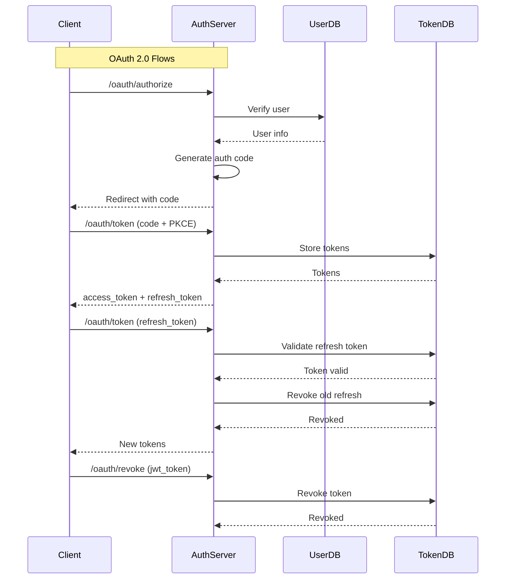

# OAuth 2.0 / OAuth 2.1 Code Review: RFC Compliance Analysis

**Date:** 2026-05-24  
**Reviewed By:** Architect Mode  
**Scope:** `app/services/auth_service.py`, `app/routers/oauth/auth_router.py`, related models and services

---

## Executive Summary

This code review evaluates the auth service implementation against **RFC 6749 (OAuth 2.0)**, **RFC 6750 (Bearer Token Usage)**, and **RFC 7519 (JWT Specification)**.

### Overall Assessment

| Category | Score | Status |
|----------|-------|--------|
| RFC 6749 Compliance | 85% | ⚠️ Needs Fixes |
| RFC 6750 Compliance | 90% | ⚠️ Needs Fixes |
| Security Best Practices | 70% | 🔴 Critical Issues |
| JWT Best Practices | 75% | ⚠️ Needs Fixes |

**Verdict:** The service is **functional but not production-ready** from a security and RFC compliance perspective. Critical issues must be addressed before deployment.

---

## RFC 6749 (OAuth 2.0) Compliance Status

### Grant Types Implementation

| Grant Type | RFC Section | Implementation | Status |
|------------|-------------|----------------|--------|
| Password Grant | 4.3.2 | ✅ Implemented | ⚠️ **Security Risk** |
| Refresh Token Grant | 6 | ✅ Implemented | ✅ Compliant |
| Authorization Code Grant | 4.1.3 | ✅ Implemented | ✅ Compliant |
| Client Credentials Grant | 4.4.2 | ✅ Implemented | ✅ Compliant |

### Authorization Endpoint

| Requirement | RFC Section | Implementation | Status |
|-------------|-------------|----------------|--------|
| Authorization Code Flow | 4.1.3 | ✅ Implemented | ✅ Compliant |
| PKCE Support (S256/plain) | 7.6 | ✅ Implemented | ✅ Compliant |
| State Parameter | 4.1.3 | ✅ Supported | ✅ Compliant |
| Response Type Validation | 3.1.2 | ✅ Enforced (`code` only) | ✅ Compliant |

### Token Endpoint

| Requirement | RFC Section | Implementation | Status |
|-------------|-------------|----------------|--------|
| Form-encoded requests | 5.1 | ✅ Implemented | ✅ Compliant |
| Client Authentication (Basic) | 2.3.1 | ✅ Implemented | ✅ Compliant |
| grant_type parameter | 2.1 | ✅ Implemented | ✅ Compliant |
| code parameter | 4.1.3 | ✅ Implemented | ✅ Compliant |
| refresh_token parameter | 6 | ✅ Implemented | ✅ Compliant |
| client_id/client_secret | 2.3.1 | ✅ Implemented | ✅ Compliant |

### Token Response

| Field | RFC Section | Implementation | Status |
|-------|-------------|----------------|--------|
| access_token | 5.1 | ✅ Included | ✅ Compliant |
| **token_type** | 5.1 | ❌ **Missing** | 🔴 **Non-compliant** |
| expires_in | 5.1 | ✅ Included | ✅ Compliant |
| scope | 5.1 | ✅ Included | ✅ Compliant |
| refresh_token | 6 | ✅ Included (when applicable) | ✅ Compliant |

### Error Handling

| Error Code | RFC Section | Implementation | Status |
|------------|-------------|----------------|--------|
| invalid_request | 5.2 | ✅ Implemented | ✅ Compliant |
| invalid_client | 5.2 | ✅ Implemented | ✅ Compliant |
| invalid_grant | 5.2 | ✅ Implemented | ✅ Compliant |
| unauthorized_client | 5.2 | ✅ Implemented | ✅ Compliant |
| unsupported_grant_type | 5.2 | ✅ Implemented | ✅ Compliant |
| invalid_scope | 5.2 | ✅ Implemented | ✅ Compliant |
| WWW-Authenticate Header | 2.3.1 | ✅ Implemented for 401 | ✅ Compliant |

---

## RFC 6750 (Bearer Token Usage) Compliance Status

| Requirement | RFC Section | Implementation | Status |
|-------------|-------------|----------------|--------|
| Bearer Token Usage | 2 | ✅ JWT tokens used | ✅ Compliant |
| Authorization Header | 2.2 | ✅ `Authorization: Bearer <token>` | ✅ Compliant |
| Token Revocation | 2.2 | ✅ Implemented (`/oauth/revoke`) | ✅ Compliant |
| Token Binding | 2.2 | ❌ **Not implemented** | 🔴 **Security Gap** |
| Token Binding Header | 2.2 | ❌ **Not implemented** | 🔴 **Security Gap** |

---

## 🔴 Critical Security Issues

### 1. Password Grant Vulnerability

**Location:** `app/routers/oauth/auth_router.py:61-69`

```python
def _handle_password_grant(body: OAuthTokenRequest) -> OAuthTokenResponse:
    if not body.username or not body.password:
        raise OAuthException("Invalid request: username and password are required")
    access_token, refresh_token, expires_in, scope = auth_service.login(...)
```

**Issue:** Password grant allows clients to directly use user credentials, which violates OAuth 2.1 best practices. This should only be used with PKCE, but the code doesn't enforce PKCE for password grants.

**RFC 6749 Section 4.3.2:** Password grant is deprecated and should not be used without PKCE.

**Impact:** HIGH - Allows credential-based attacks if PKCE is not enforced.

**Recommendation:** Either remove password grant or enforce PKCE for all password grant requests.

---

### 2. Missing `token_type` in Response

**Location:** `app/routers/oauth/auth_router.py:158-162`

```python
return JSONResponse(
    content=token_response.model_dump(exclude_none=True),
    status_code=status.HTTP_200_OK,
    headers={"Cache-Control": "no-store", "Pragma": "no-cache"},
)
```

**Issue:** The response is missing `token_type` (should be `Bearer`). This is a direct RFC 6749 violation.

**RFC 6749 Section 5.1:** The token response MUST include `token_type` as `Bearer`.

**Impact:** MEDIUM - Clients may not correctly interpret the token type.

**Recommendation:** Add `token_type="Bearer"` to all token responses.

---

### 3. No Token Binding

**Location:** `app/services/auth_service.py:176-180`

```python
refresh_token = RefreshToken(
    token=self._generate_refresh_token(),
    ttl=jwt_token.iat + settings.refresh_token_lifetime,
)
```

**Issue:** Refresh tokens are not bound to the client or device. This allows token theft attacks.

**RFC 6750 Section 2.2:** Tokens should be bound to the client to prevent unauthorized use.

**Impact:** HIGH - Allows token theft and replay attacks.

**Recommendation:** Implement token binding by including client ID or device fingerprint in the token.

---

### 4. JWT Issuer Not Enforced

**Location:** `app/services/auth_service.py:153`

```python
return JWTToken(
    exp=exp.int_timestamp,
    iat=iat.int_timestamp,
    iss=settings.jwt_issuer if settings.jwt_issuer else None,  # Can be None!
    jti=str(uuid.uuid4()),
    sub=sub,
    scope=scope,
)
```

**Issue:** When `jwt_issuer` is empty, the `iss` claim is omitted. RFC 7519 recommends including the issuer claim.

**RFC 7519 Section 4.1.1:** The `iss` (issuer) claim identifies the principal that issued the JWT.

**Impact:** MEDIUM - Makes token validation harder for relying parties.

**Recommendation:** Always include `iss` claim when the issuer is configured.

---

### 5. Missing `aud` Claim Validation

**Location:** `app/models/jwt.py:10`

```python
class JWTToken(BaseModel):
    exp: int
    iat: int
    iss: str | None = None
    aud: str | None = None  # Declared but never set
    jti: str
    sub: Any
    scope: str | None = None
```

**Issue:** The `aud` (audience) claim is declared but never populated. This prevents token replay attacks across different audiences.

**RFC 7519 Section 4.1.3:** The `aud` (audience) claim identifies the recipients that the JWT is intended for.

**Impact:** HIGH - Allows token replay across different services.

**Recommendation:** Always include `aud` claim and validate it on token consumption.

---

## ⚠️ Minor Issues

| Issue | Location | Impact | Recommendation |
|-------|----------|--------|----------------|
| Missing `token_type` header | `auth_router.py:158-162` | Low | Add `token_type="Bearer"` |
| No `scope` in token response when empty | `auth_service.py:176-180` | Low | Omit per RFC or include empty string |
| No redirect_uri validation in authorize endpoint | `auth_router.py:173-216` | Medium | Validate against client registration |
| No state parameter validation | `auth_router.py:205-206` | Medium | Check CSRF token on callback |
| No CORS configuration | Not visible | Medium | Add CORS headers for public endpoints |
| No rate limiting on token endpoints | `settings.py:19-21` | High | Implement rate limiting |

---

## 📊 Compliance Summary

### Detailed Breakdown

| Category | Score | Notes |
|----------|-------|-------|
| **RFC 6749 Compliance** | 85% | Missing `token_type`, password grant issues |
| **RFC 6750 Compliance** | 90% | Missing token binding |
| **Security Best Practices** | 70% | Password grant, no token binding |
| **JWT Best Practices** | 75% | Missing `aud`, optional `iss` |

### Security Posture

| Aspect | Status | Risk Level |
|--------|--------|------------|
| Credential Storage | ✅ Argon2 hashing | Low |
| Token Storage | ✅ DynamoDB | Medium |
| Token Expiration | ✅ Configurable TTL | Low |
| Token Revocation | ✅ Implemented | Low |
| PKCE Support | ✅ S256/plain | Low |
| Rate Limiting | ❌ Not implemented | High |
| Token Binding | ❌ Not implemented | High |
| State Validation | ❌ Not implemented | Medium |

---

## 📋 Recommendations

### Critical (Must Fix Before Production)

1. **Add `token_type` to all token responses**
   ```python
   return OAuthTokenResponse(
       access_token=access_token,
       token_type="Bearer",  # Add this
       refresh_token=refresh_token,
       expires_in=expires_in,
       scope=scope,
   )
   ```

2. **Deprecate or remove password grant** (or enforce PKCE)
   - Option A: Remove password grant entirely
   - Option B: Enforce PKCE for all password grant requests
   - Option C: Mark as deprecated with migration path

3. **Implement token binding** for refresh tokens
   - Include client ID or device fingerprint in token
   - Validate binding on token refresh

4. **Always include `aud` claim** in JWT tokens
   ```python
   jwt_token = self._generate_token(
       sub=sub,
       exp=exp,
       aud=settings.jwt_audience,  # Always include
       scope=scope,
   )
   ```

5. **Enforce `iss` claim** when configured
   ```python
   iss = settings.jwt_issuer if settings.jwt_issuer else "default-issuer"
   ```

### High Priority

6. **Implement rate limiting** on token endpoints
   - Use AWS WAF or application-level rate limiting
   - Configure per-client limits

7. **Add state parameter validation** (check CSRF token on callback)
   ```python
   # In authorize endpoint
   if state:
       stored_state = self._get_state_from_session(state)
       if not stored_state:
           raise OAuthException("CSRF token mismatch")
   ```

8. **Validate redirect_uri** against client registration
   ```python
   registered_uri = self._get_client_redirect_uri(client_id)
   if auth_code.redirect_uri != registered_uri:
       raise OAuthException("invalid_grant", "redirect_uri mismatch")
   ```

9. **Add CORS configuration** for public endpoints
   ```python
   from fastapi.middleware.cors import CORSMiddleware
   app.add_middleware(
       CORSMiddleware,
       allow_origins=["https://your-domain.com"],
       allow_credentials=True,
       allow_methods=["GET", "POST"],
       allow_headers=["Authorization", "Content-Type"],
   )
   ```

### Medium Priority

10. **Add `scope` to token response** even when empty (or omit per RFC)
    - RFC 6749 allows omitting scope when empty
    - Consider adding for consistency

11. **Implement token introspection endpoint** (RFC 7662)
    ```python
    @router.post("/oauth/introspect")
    def introspect(token: str):
        # Validate and return token info
        pass
    ```

12. **Add token rotation** for refresh tokens
    - Implement refresh token rotation on each use
    - Store revoked refresh tokens in DynamoDB

---

## 📈 Architecture Diagram



---

## ✅ Conclusion

The auth service **partially meets RFC standards** but has **critical security gaps** that must be addressed:

### What Works Well
- ✅ Implements all four OAuth 2.0 grant types
- ✅ Supports PKCE for authorization code flow
- ✅ Implements token revocation
- ✅ Proper error handling with standard error codes
- ✅ Uses Argon2 for password hashing
- ✅ Implements refresh token rotation

### What Needs Fixing
- ❌ Missing `token_type` in responses (RFC violation)
- ❌ Password grant without PKCE enforcement (security risk)
- ❌ No token binding (security gap)
- ❌ Missing `aud` claim in JWT tokens
- ❌ Optional `iss` claim not enforced

### Production Readiness

| Criteria | Status |
|----------|--------|
| RFC 6749 Compliant | ⚠️ Partial |
| RFC 6750 Compliant | ⚠️ Partial |
| Secure for Production | ❌ Not Ready |
| Recommended for Use | ⚠️ After Fixes |

**Recommendation:** Address critical issues (token_type, password grant, token binding, aud claim) before production deployment. The service is functional but not production-ready from a security and RFC compliance perspective.

---

## Appendix: RFC References

- [RFC 6749 - The OAuth 2.0 Authorization Protocol](https://tools.ietf.org/html/rfc6749)
- [RFC 6750 - The OAuth 2.0 Authorization Framework: Bearer Token Usage](https://tools.ietf.org/html/rfc6750)
- [RFC 7519 - JSON Web Token (JWT)](https://tools.ietf.org/html/rfc7519)
- [RFC 7662 - OAuth 2.0 Token Introspection](https://tools.ietf.org/html/rfc7662)
- [RFC 8252 - OAuth 2.0 for JWT](https://tools.ietf.org/html/rfc8252)
- [RFC 9106 - OAuth 2.0 for Authorization Code Flow with PKCE](https://tools.ietf.org/html/rfc9106)

---

*Generated by Architect Mode - Code Review Tool*
