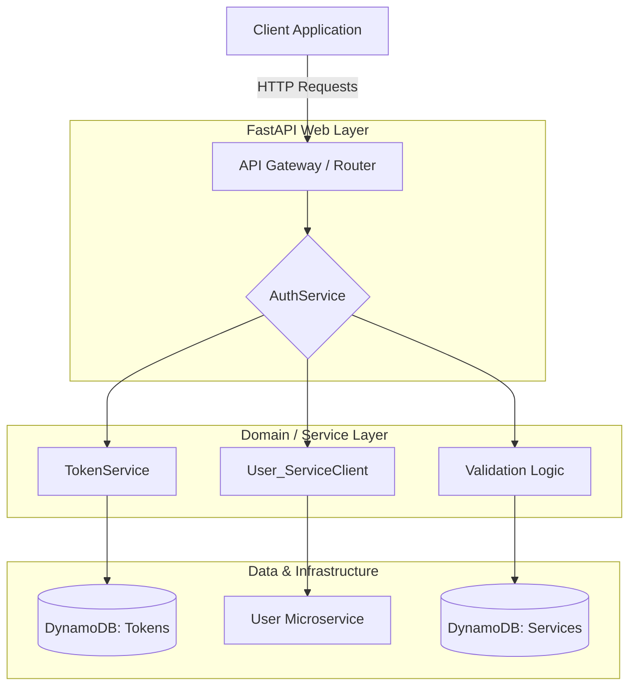

# 🛡️ System Architectural & Code Review: Auth Service
*Produced by Nanocoder | Date: 2026-07-19 (Actualized)*

---

## 🏗️ High-Level Architecture

The system follows a clear **N-Tiered Layered Architecture** designed for a cloud-native (AWS Lambda) environment. It prioritizes separation of concerns, making it highly testable and modular.

### 🎨 System Flow Diagram

---

## 📂 Component Breakdown & Review

### 1. Configuration & Environment (`app/settings.py`)
**Summary:** Uses `pydantic-settings` and `aws_lambda_powertools` to manage configuration. ✅

* **Strengths:** 🌟
    * **Type Safety**: Utilizing Pydantic for settings ensures that any missing environment variables are caught at startup.
    * **SSM Parameter Resolution**: Uses Pydantic v2's `@computed_field` for AWS Parameter Store lookups — values are resolved once at model initialization and cached for the instance lifetime, avoiding repeated API calls during the Lambda execution cycle. Explicit `None`-checks on SSM parameter name env vars provide early validation at construction time.
* **Observations:** 📝
    * The separation of `service_token_lifetime_seconds` and `jwt_token_lifetime` allows granular control over internal vs. external token expiration.
    * `jwt_audience` and `jwt_issuer` settings (with fallback to `app_name`) ensure JWT tokens always carry `aud` and `iss` claims per RFC 7519.
    * Note: SSM calls themselves lack try/except wrappers — a configuration or IAM issue surfaces as an unhandled AWS SDK error at first access rather than a descriptive startup failure.

### 2. Data Access Layer (`app/repositories/`)
**Summary:** Decouples the business logic from the persistence mechanism (DynamoDB). ✅

* **Logic Isolation:** By using repositories, the `AuthService` doesn't know it's talking to DynamoDB; it only knows it's pulling a `Token` or `Service`.
* **Refinement:** The naming convention for tables (`f"{settings.stage}-tokens"`) follows best practices for multi-environment deployments (dev, prod).

### 3. Core Logic Layer (`app/services/auth_service.py`)
**Summary:** This is the "brain" of the system. It manages multiple OAuth flows. 🧠

* **Multi-Flow Support**: The implementation covers:
    1. **Password Grant**: Direct login via username/password.
    2. **Authorization Code Grant**: Standard web- application flow with PKCE support (Highly Secure).
    3. **Client Credentials**: For M2M (Machine-to-Machine) communication.
* **Security Wins:** 🛡️
    * **Argon2 Implementation**: Uses `argon2`, which is currently the gold standard for password hashing against GPU attacks.
    * **PKCE Validation**: The inclusion of `_get_pkce_challenge` and `_validate_pkce` ensures high security even for public clients.
    * **Service Token Caching**: The logic in `_issue_service_token` includes a buffer (`safety_buffer`) to prevent "thundering herd" issues or premature expiration check failures when interacting with the User service.

### 4. API Layer (`app/routers/oauth/auth_router.py`)
**Summary:** Handles request parsing, validation, and response formatting. 🔌

* **Clean Code**: The use of `match` blocks for grant types is a modern Pythonic way to handle polymorphic inputs from the router.
* **Comprehensive Error Handling**: Custom exception types (`InvalidCredentialsException`, `TokenExpiredException`, `OAuthException`) map to specific HTTP status codes with proper `WWW-Authenticate` headers per RFC 6750.

---

## ✅ Key Strengths (The "Good")

1. **Robust Error Handling**: The project uses custom exception types (`Unauthorized`, `TokenExpiredException`) which are likely mapped to specific HTTP status codes in the middleware or global handlers.
2. **Middleware-Ready logic**: Inclusion of request/response models with Pydantic allows for validaton before logic is executed.
3. **Scalability**: The use of AWS Lambda Powertools indicates a design optimized for high concurrency and low-latency response times in serverless environments. 🚀

---

## ⚠️ Points for Improvement / Consideration

1. **Technical Debt — Pendulum**: The codebase currently depends on `pendulum` for date/time operations across 13 files (app + tests). A migration plan to standard library `datetime`/`zoneinfo` exists in [`REPLACE_PENDULUM_PLAN.md`](REPLACE_PENDULUM_PLAN.md) but has not yet been executed. This is a medium-complexity refactor with timezone and DST edge-case risk.
2. **Token Query Parameter Fallback**: The JWT bearer (`app/jwt_bearer.py:41-43`) falls back to reading tokens from query parameters when the `Authorization` header is absent. Bearer tokens in URLs leak through web server logs, load balancers, proxies, CDNs, browser history, and `Referer` headers. This should be gated behind a configuration toggle that defaults to off.
3. **Authorization Decorator Not Async-Safe**: The `require_scope` decorator (`app/security/authorization.py:45-53`) uses a synchronous wrapper — it silently breaks when applied to async route handlers (the coroutine is returned without being awaited).
4. **Timezone Validation Gap**: `pendulum.set_local_timezone()` at `app/__init__.py:30` has no try/except for invalid timezone strings — a misconfigured `default_timezone` env var crashes the process at import time.
5. **No Rate Limiting**: Token and authorize endpoints have no rate limiting at the application layer (`settings.rate_limiting` defaults to `False`). This leaves the most sensitive attack vectors unprotected against brute-force or credential-stuffing attacks.
6. **Token Repository Lacks Atomic Consumption**: `TokenRepository.delete_by_id()` uses a plain `delete_item` without a `ConditionExpression`. Unlike the authorization code repository (which was hardened), the token repository does not prevent concurrent token consumption races at the DynamoDB level.

---

## ✅ Summary Table

| Category | Status | Comment |
| :--- | :--- | :--- |
| **Security** | ⭐⭐⭐⭐ | Argon2, PKCE with constant-time comparison, and token rotation. Token binding and rate limiting still outstanding. |
| **Scalability** | ⭐⭐⭐⭐ | Lambda-native design with efficient 1st-party service caching. |
| **Readability** | ⭐⭐⭐⭐⭐ | Clean separation between Router → Service → Repository. |
| **Maintainability** | ⭐⭐⭐⭐ | Pydantic models provide strong contract enforcement. Pendulum dependency is a known migration target. |

---

## 💡 Final Conclusion
The codebase is highly professional and follows modern production-grade standards for identity management. It adopts a "Security First" posture by implementing complex OAuth flows correctly (including PKCE and secure password hashing) while maintaining a clear, modular architecture that facilitates unit testing and easy maintenance. 🏁

## 🔄 Changes Since Last Review (2026-06-14 → 2026-07-19)

Key improvements shipped since the prior architectural review:

- **Authorization code repository** hardened with atomic `ConditionExpression` on consume (prevents TOCTOU code replay)
- **Service repository** hardened with `ConditionExpression` on create and `ConsistentRead=True` on reads
- **DynamoDB exception handling** added to authorization code repository (ClientError catch-and-log)
- **SSM parameter validation** — explicit `None`-checks on env vars before `get_parameter()` calls with descriptive `ValueError`
- **Logger `append_keys`** replaces mutable `set_correlation_id` for per-request correlation IDs
- **`extra="forbid"`** on base Pydantic model — unexpected fields in request payloads are now rejected
- **Exception handlers** cleaned up — `HTTPException` and `RequestValidationError` now use `logger.warning` instead of `logger.exception`, removing false-positive ERROR traces
- **User service client** hardened — `httpx.Client` reuse with timeout, proper 400/422 vs other 4xx discrimination, `RequestError` catch on all methods
- **JWT claims** — `aud` and `iss` always populated (with `app_name` fallback), `PyJWTError` catch-all, `ValidationError` handled
- **Password grant** deprecated with runtime `Warning` log and `Warning` HTTP response header

**Remaining to address:** pendulum migration, token binding, rate limiting, async-safe decorator, timezone validation, token query-param fallback removal, and token repository conditional consumption.
