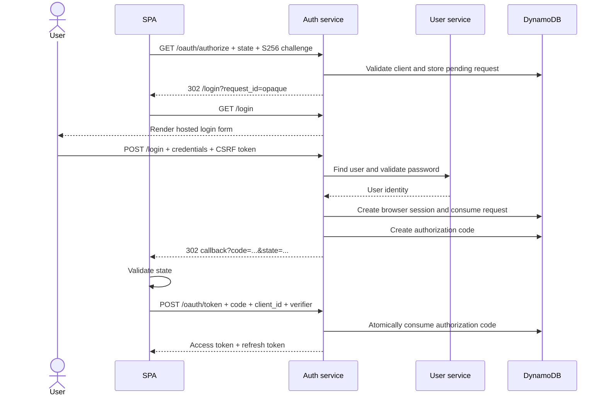

# Current Authentication Flows

## Token endpoint

`POST /oauth/token` accepts form-encoded requests for:

- `password`: legacy resource-owner password grant; still supported and marked
  deprecated with a `Warning` response header.
- `authorization_code`: exchanges a stored, short-lived code. Modern PKCE
  codes require `client_id`, `redirect_uri`, and `code_verifier`.
- `refresh_token`: rotates the refresh token atomically.
- `client_credentials`: authenticates the client with HTTP Basic credentials.

The password grant issues the normal application access and refresh tokens. It
must not be removed as part of the SPA migration.

## Modern browser authorization flow

The browser cookie contains only an opaque session ID. Passwords, OAuth
tokens, authorization codes, and PKCE verifiers are not stored in it.

## Compatibility authorization flow

Existing bearer-authenticated callers may still use `/oauth/authorize` to
create a code. This path is retained while clients migrate. New SPA clients
must use the browser-session path and `S256` PKCE.

## Data stores

Terraform provisions these additional tables:

- `${stage}-${app_name}-browser-sessions`
- `${stage}-${app_name}-pending-authorization-requests`

Both use opaque IDs as partition keys and DynamoDB TTL for cleanup. Application
logic checks expiry as well as relying on DynamoDB TTL.
