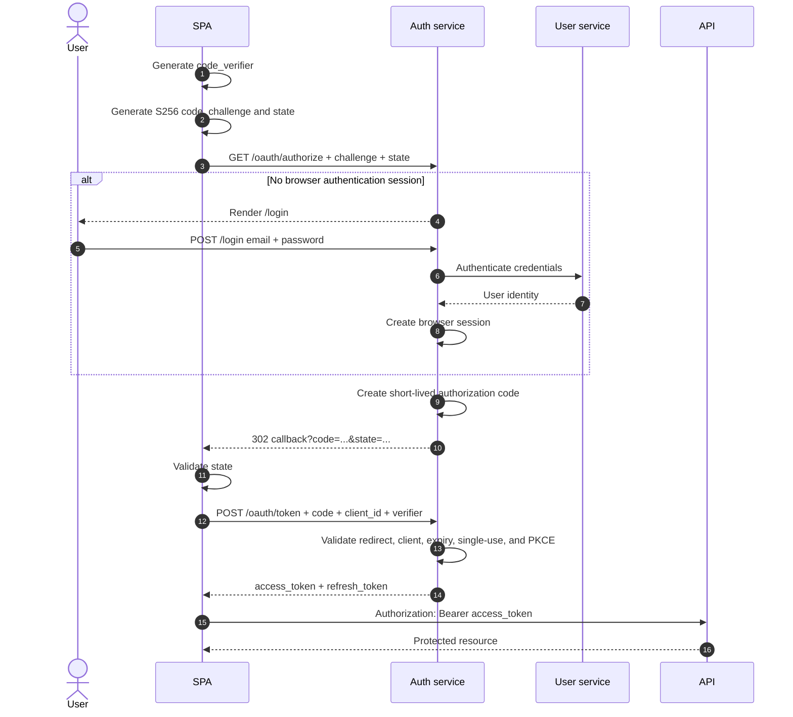

# Authentication Architecture

## Preferred SPA flow



The SPA is a public OAuth client and has no client secret. User credentials are
submitted to the hosted authorization-server login page, never to the SPA's
token exchange. New client registrations should allow `authorization_code` and
`refresh_token` and omit `password` from `allowed_grant_types`.

## Separate security concepts

Password authentication answers: “Who is the user?”

PKCE answers: “Does the exchanger possess the verifier associated with this
authorization request?” PKCE does not authenticate the user.

The authorization code binds the authenticated user, client, redirect URI, and
PKCE challenge until the single-use token exchange.

## Legacy flow

```text
POST /oauth/token
grant_type=password
username=...
password=...
```

This grant is deprecated and exists for backwards compatibility only. It must
remain operational until all legacy clients migrate.

## Browser session controls

The server stores the user association and expiry in DynamoDB. The browser
stores only an opaque `auth_session` cookie configured as `HttpOnly`,
`SameSite=Lax`, `Path=/`, and `Secure` in production. `/logout` deletes the
server-side session and expires the cookie. The login form also uses a
short-lived CSRF cookie bound to the pending authorization request; the form
token and cookie must both match before credentials are accepted.
