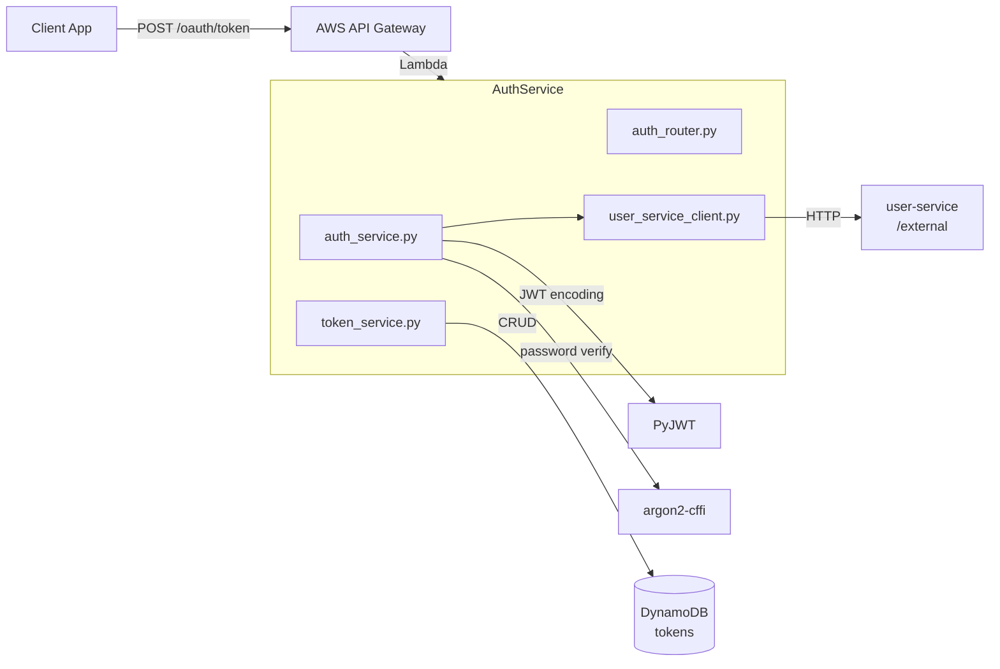
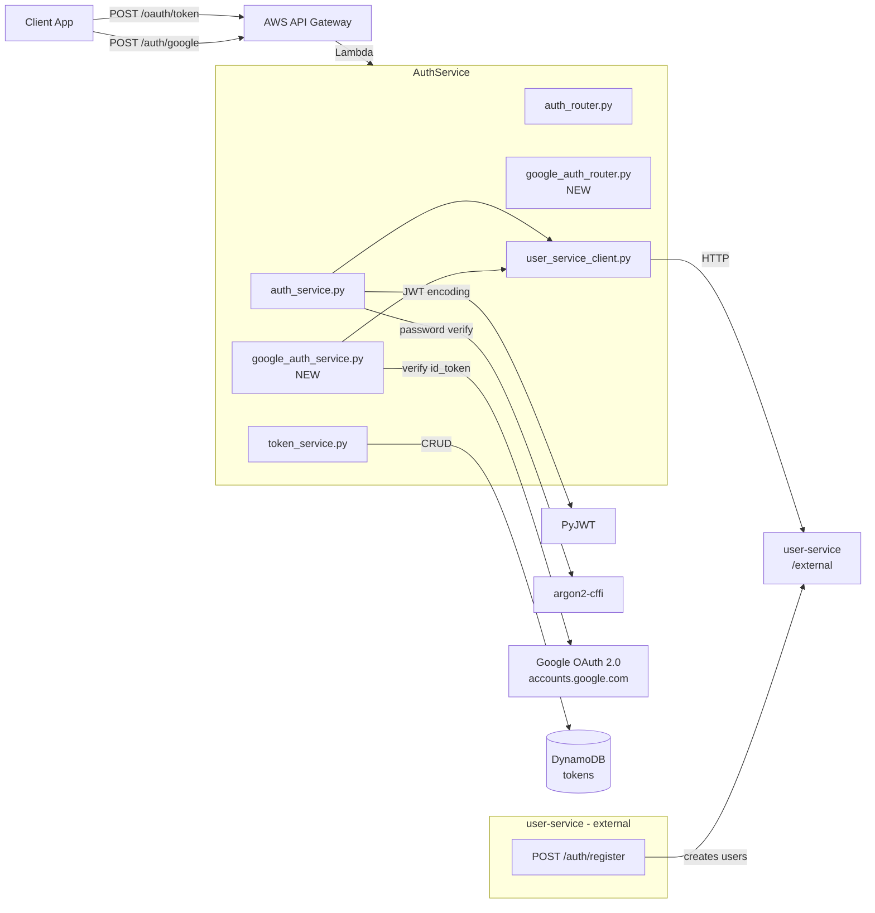
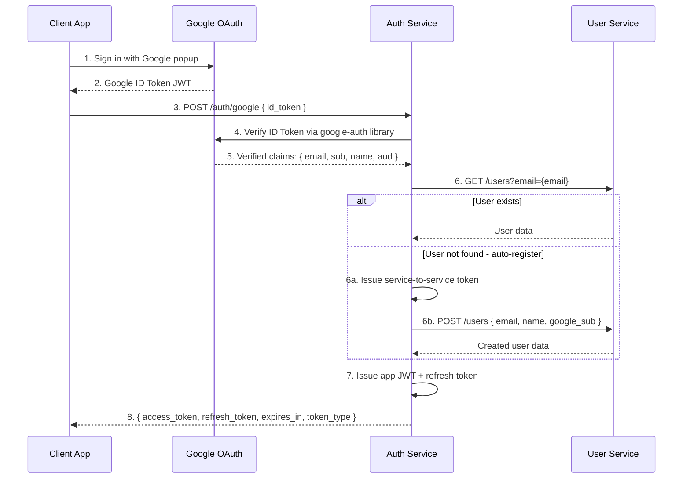
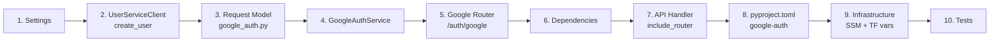

# Google Auth — Feasibility Analysis + Implementation Plan

## 1. Executive Summary

**Verdict: Yes, this is easily feasible.** The existing architecture cleanly accommodates a Google OAuth sign-in flow with auto-registration.

This service only adds **`POST /auth/google`** — a single endpoint for Google Sign-In. Registration (email/password) is handled exclusively by the **user-service**, which has its own register endpoint. When a Google user signs in for the first time, this service auto-creates them in the user-service via `UserServiceClient.create_user()`.

---

## 2. Current Architecture (as-is)

### 2.1 Service Diagram



### 2.2 Existing Endpoints

| Endpoint | Purpose | Status |
|---|---|---|
| `POST /oauth/token` | OAuth 2.0 token (password, refresh, auth code, client_creds) | ✅ Existing |
| `POST /oauth/revoke` | Revoke tokens | ✅ Existing |
| `GET /oauth/authorize` | Authorization code grant | ✅ Existing |
| `GET /health` | Health check | ✅ Existing |
| **`POST /auth/google`** | **Google Sign-In (proposed)** | **❌ New** |

### 2.3 Key Files

| File | Purpose |
|---|---|
| [`app/routers/oauth/auth_router.py`](../app/routers/oauth/auth_router.py) | HTTP route definitions for OAuth 2.0 endpoints |
| [`app/services/auth_service.py`](../app/services/auth_service.py) | Core business logic: login, token generation, PKCE, credential validation |
| [`app/services/token_service.py`](../app/services/token_service.py) | Token CRUD operations on DynamoDB |
| [`app/clients/user_service_client.py`](../app/clients/user_service_client.py) | HTTP client for the external user-service |
| [`app/settings.py`](../app/settings.py) | Pydantic settings with AWS SSM parameter resolution |
| [`app/dependencies.py`](../app/dependencies.py) | FastAPI dependency injection wiring |
| [`app/api_handler.py`](../app/api_handler.py) | FastAPI app creation, middleware, exception handlers |
| [`app/models/response/token.py`](../app/models/response/token.py) | OAuth 2.0 token response model |

---

## 3. Proposed Changes

### 3.1 High-Level Architecture (After)



### 3.2 Google Sign-In Flow



**Registration flow (email/password):** Handled entirely by the user-service at its own endpoint. Not in scope for this service.

---

## 4. Implementation Steps

### Step 1: Google Client ID Setting

**File:** [`app/settings.py`](../app/settings.py) — already done.

Add a new computed field after `user_service_base_url`:

```python
@computed_field
@cached_property
def google_client_id(self) -> str:
    logger.debug("Resolving google_client_id from parameter store")
    param_name = os.environ.get("GOOGLE_CLIENT_ID_SSM_PARAM_NAME")
    if param_name is None:
        raise ValueError("GOOGLE_CLIENT_ID_SSM_PARAM_NAME is not set")
    return parameters.get_parameter(param_name)
```

**File:** [`.env.example`](../.env.example) — already done.

Add:
```
GOOGLE_CLIENT_ID_SSM_PARAM_NAME=/dev/auth-service/google-client-id
```

### Step 2: Add `create_user` to UserServiceClient

**File:** [`app/clients/user_service_client.py`](../app/clients/user_service_client.py) — already done.

Add method to create users in the user-service (used by Google auto-registration):

```python
def create_user(
    self,
    email: str,
    name: str,
    jwt_token: str,
    password_hash: str | None = None,
    google_sub: str | None = None,
) -> dict:
    """Create a new user in the user-service. Returns the created user dict."""
    logger.info("Creating user in user-service email=%s", email)
    payload: dict[str, str] = {"email": email, "name": name}
    if password_hash is not None:
        payload["password_hash"] = password_hash
    if google_sub is not None:
        payload["google_sub"] = google_sub

    try:
        response = self._client.post(
            f"{settings.user_service_base_url}/api/v1/users",
            json=payload,
            headers={"Authorization": f"Bearer {jwt_token}"},
        )
        response.raise_for_status()
    except httpx.HTTPStatusError as err:
        logger.error(
            "Error creating user in user-service: status=%s response=%s",
            err.response.status_code,
            err.response.text,
        )
        raise
    except httpx.RequestError as err:
        logger.error("Connection error creating user in user-service: %s", err)
        raise

    result = response.json()
    logger.info("User created in user-service user_id=%s", result.get("id"))
    return result
```

### Step 3: Create Google Auth Request Model

**File:** [`app/models/request/google_auth.py`](../app/models/request/google_auth.py) — NEW

```python
from pydantic import BaseModel, Field


class GoogleAuthRequest(BaseModel):
    """Request body for ``POST /auth/google``."""

    id_token: str = Field(min_length=1)
    """The Google-issued JWT ID token."""
```

### Step 4: Create GoogleAuthService

**File:** [`app/services/google_auth_service.py`](../app/services/google_auth_service.py) — NEW

```python
"""Service for Google OAuth authentication via ID token verification."""

from aws_lambda_powertools import Logger

import google.auth.transport.requests
import google.oauth2.id_token

from app import settings
from app.clients.user_service_client import UserServiceClient
from app.exceptions import InvalidCredentialsException
from app.services.auth_service import AuthService

logger = Logger()

ERROR_MESSAGE_INVALID_GOOGLE_TOKEN = "Invalid Google ID token"


class GoogleAuthService:
    """Handle Google Sign-In ID token verification and user resolution.

    Verifies Google-issued JWTs using google-auth library, resolves
    the user from the external user-service, and auto-creates users
    on first sign-in.
    """

    def __init__(
        self,
        user_service_client: UserServiceClient,
        auth_service: AuthService,
    ) -> None:
        self._logger = Logger()
        self._user_service_client = user_service_client
        self._auth_service = auth_service

    def authenticate(self, id_token: str) -> dict:
        """Verify a Google ID token and return the authenticated user.

        1. Verify the Google ID token signature, audience, and expiry.
        2. Extract email and Google sub from verified claims.
        3. Look up user by email in the user-service.
        4. If not found, auto-create the user via the user-service.
        5. Return the user dict.

        Raises:
            InvalidCredentialsException: If the token is invalid.
        """
        self._logger.info("Starting Google ID token verification")

        try:
            request = google.auth.transport.requests.Request()
            claims = google.oauth2.id_token.verify_oauth2_token(
                id_token,
                request,
                settings.google_client_id,
            )
        except ValueError as exc:
            self._logger.warning(
                "Google ID token verification failed",
                extra={"error": str(exc)},
            )
            raise InvalidCredentialsException(ERROR_MESSAGE_INVALID_GOOGLE_TOKEN)

        email = claims.get("email")
        if not email:
            self._logger.warning("Google ID token missing email claim")
            raise InvalidCredentialsException(ERROR_MESSAGE_INVALID_GOOGLE_TOKEN)

        google_sub = claims["sub"]
        name = claims.get("name", email)
        self._logger.info(
            "Google token verified for email=%s google_sub=%s",
            email,
            google_sub,
        )

        # Issue a service token to talk to the user-service
        import jwt as pyjwt

        service_token = self._auth_service._issue_service_token(
            settings.app_name,
            settings.client_secret,
        )
        service_token_str = pyjwt.encode(
            service_token.model_dump(exclude_none=True),
            settings.jwt_secret,
        )

        # Look up user by email
        user = self._user_service_client.get_user_by_email(email, service_token_str)

        if user is None:
            self._logger.info(
                "User not found email=%s - auto-registering via Google",
                email,
            )
            user = self._user_service_client.create_user(
                email=email,
                name=name,
                jwt_token=service_token_str,
                password_hash=None,
                google_sub=google_sub,
            )
            self._logger.info(
                "User auto-registered via Google user_id=%s",
                user.get("id"),
            )
        else:
            self._logger.info(
                "Existing user found user_id=%s",
                user.get("id"),
            )

        return user
```

### Step 5: Create Google Auth Router

**File:** [`app/routers/auth/google_router.py`](../app/routers/auth/google_router.py) — NEW

```python
"""Router for Google Sign-In authentication."""

from typing import Annotated

import jwt as pyjwt
from aws_lambda_powertools import Logger
from fastapi import APIRouter, Depends

from app import settings
from app.dependencies import get_auth_service, get_google_auth_service
from app.models.request.google_auth import GoogleAuthRequest
from app.models.response.token import OAuthTokenResponse
from app.services.auth_service import AuthService
from app.services.google_auth_service import GoogleAuthService

logger = Logger()

router = APIRouter(tags=["auth"])


@router.post(
    "/auth/google",
    response_model=OAuthTokenResponse,
    status_code=200,
)
def google_auth(
    body: GoogleAuthRequest,
    google_auth_service: Annotated[GoogleAuthService, Depends(get_google_auth_service)],
    auth_service: Annotated[AuthService, Depends(get_auth_service)],
) -> OAuthTokenResponse:
    """Sign in or register with a Google ID token.

    Verifies the provided Google ID token, resolves the user from
    the user-service (auto-creating if first sign-in), and returns
    app JWT access + refresh tokens.
    """
    logger.info("Google auth endpoint called")

    user = google_auth_service.authenticate(body.id_token)
    user_id = user["id"]

    # Issue app tokens using the existing token generation machinery
    jwt_token, refresh_token = auth_service._generate_tokens(user_id, scope=None)

    logger.info(
        "Google auth succeeded for user_id=%s",
        user_id,
    )

    return OAuthTokenResponse(
        access_token=pyjwt.encode(
            jwt_token.model_dump(exclude_none=True),
            settings.jwt_secret,
        ),
        refresh_token=refresh_token.token,
        expires_in=settings.jwt_token_lifetime,
        scope=None,
    )
```

### Step 6: Wire Dependencies

**File:** [`app/dependencies.py`](../app/dependencies.py)

Add import and new provider function:

```python
from app.services.google_auth_service import GoogleAuthService


def get_google_auth_service(
    user_service_client: UserServiceClient = Depends(get_user_service_client),
    auth_service: AuthService = Depends(get_auth_service),
) -> GoogleAuthService:
    return GoogleAuthService(
        user_service_client=user_service_client,
        auth_service=auth_service,
    )
```

### Step 7: Register Router in API Handler

**File:** [`app/api_handler.py`](../app/api_handler.py)

Add import and router registration:

```python
from app.routers.auth.google_router import router as google_auth_router

# Add after the existing include_router:
app.include_router(google_auth_router)
```

### Step 8: Add Dependency

**File:** [`pyproject.toml`](../pyproject.toml)

```toml
dependencies = [
    "argon2-cffi>=25.1.0",
    "fastapi>=0.128.6",
    "google-auth>=2.38.0",
    "httpx2",
    # ... rest unchanged
]
```

### Step 9: Infrastructure Changes

**File:** [`infrastructure/variables.tf`](../infrastructure/variables.tf)

```hcl
variable "google_client_id_ssm_param_name" {
  type = string
}
```

**File:** [`infrastructure/ssm.tf`](../infrastructure/ssm.tf)

```hcl
resource "aws_ssm_parameter" "google_client_id" {
  name      = "/${var.stage}/auth-service/google-client-id"
  type      = "String"
  value     = "your-google-oauth-client-id.apps.googleusercontent.com"
  overwrite = false
  tags      = var.tags
}
```

### Step 10: Unit Tests for GoogleAuthService

**File:** [`tests/unit/service/test_google_auth_service.py`](../tests/unit/service/test_google_auth_service.py) — NEW

```python
"""Unit tests for GoogleAuthService."""

import uuid
from unittest.mock import ANY

import pytest
from fastapi import HTTPException

from app.clients.user_service_client import UserServiceClient
from app.services.auth_service import AuthService
from app.services.google_auth_service import GoogleAuthService
from app.settings import Settings


class TestGoogleAuthService:
    """Tests for GoogleAuthService.authenticate."""

    VERIFIED_CLAIMS = {
        "email": "test@example.com",
        "sub": "google-sub-123",
        "name": "Test User",
        "aud": "test-client-id",
    }

    @pytest.fixture
    def google_auth_service(
        self,
        auth_service: AuthService,
    ) -> GoogleAuthService:
        return GoogleAuthService(
            user_service_client=UserServiceClient(),
            auth_service=auth_service,
        )

    def test_authenticate_with_valid_token_existing_user(
        self,
        mocker,
        google_auth_service: GoogleAuthService,
        user_data: dict,
        settings: Settings,
    ):
        """Valid Google ID token for existing user returns user data."""
        mock_verify = mocker.patch(
            "google.oauth2.id_token.verify_oauth2_token",
            return_value=self.VERIFIED_CLAIMS,
        )
        mocker.patch.object(
            UserServiceClient,
            "get_user_by_email",
            return_value=user_data,
        )

        result = google_auth_service.authenticate("valid-id-token")

        mock_verify.assert_called_once_with(
            "valid-id-token", ANY, settings.google_client_id
        )
        assert result == user_data

    def test_authenticate_with_valid_token_new_user(
        self,
        mocker,
        google_auth_service: GoogleAuthService,
        settings: Settings,
    ):
        """New Google user is auto-registered via user-service."""
        mocker.patch(
            "google.oauth2.id_token.verify_oauth2_token",
            return_value=self.VERIFIED_CLAIMS,
        )
        mocker.patch.object(
            UserServiceClient,
            "get_user_by_email",
            return_value=None,
        )
        created_user = {
            "id": str(uuid.uuid4()),
            "email": "test@example.com",
            "name": "Test User",
        }
        mock_create = mocker.patch.object(
            UserServiceClient,
            "create_user",
            return_value=created_user,
        )

        result = google_auth_service.authenticate("valid-id-token")

        mock_create.assert_called_once_with(
            email="test@example.com",
            name="Test User",
            jwt_token=ANY,
            password_hash=None,
            google_sub="google-sub-123",
        )
        assert result == created_user

    def test_authenticate_with_invalid_token(
        self,
        mocker,
        google_auth_service: GoogleAuthService,
    ):
        """Invalid Google ID token raises 401."""
        mocker.patch(
            "google.oauth2.id_token.verify_oauth2_token",
            side_effect=ValueError("Invalid token"),
        )

        with pytest.raises(HTTPException) as exc_info:
            google_auth_service.authenticate("invalid-token")

        assert exc_info.value.status_code == 401

    def test_authenticate_with_missing_email(
        self,
        mocker,
        google_auth_service: GoogleAuthService,
    ):
        """Google token without email claim raises 401."""
        mocker.patch(
            "google.oauth2.id_token.verify_oauth2_token",
            return_value={"sub": "no-email-user"},
        )

        with pytest.raises(HTTPException) as exc_info:
            google_auth_service.authenticate("no-email-token")

        assert exc_info.value.status_code == 401
```

### Step 11: Unit Tests for UserServiceClient.create_user

**File:** [`tests/unit/client/test_user_service_client.py`](../tests/unit/client/test_user_service_client.py)

Add test class:

```python
class TestCreateUser:
    """Tests for UserServiceClient.create_user."""

    def test_create_user_success(
        self,
        mocker,
        user_service_client: UserServiceClient,
        settings: Settings,
    ):
        """Successful user creation returns the created user dict."""
        mock_response = mocker.MagicMock()
        created_user = {"id": "user-123", "email": "new@example.com", "name": "New"}
        mock_response.json.return_value = created_user
        mock_post = mocker.patch.object(
            user_service_client._client, "post", return_value=mock_response
        )

        result = user_service_client.create_user(
            email="new@example.com",
            name="New User",
            jwt_token="service-jwt-token",
            password_hash="argon2-hash-value",
            google_sub=None,
        )

        mock_post.assert_called_once_with(
            f"{settings.user_service_base_url}/api/v1/users",
            json={
                "email": "new@example.com",
                "name": "New User",
                "password_hash": "argon2-hash-value",
            },
            headers={"Authorization": "Bearer service-jwt-token"},
        )
        assert result == created_user

    def test_create_user_with_google_sub(
        self,
        mocker,
        user_service_client: UserServiceClient,
        settings: Settings,
    ):
        """create_user includes google_sub when provided."""
        mock_response = mocker.MagicMock()
        mock_response.json.return_value = {"id": "user-123"}
        mock_post = mocker.patch.object(
            user_service_client._client, "post", return_value=mock_response
        )

        user_service_client.create_user(
            email="google@example.com",
            name="Google User",
            jwt_token="token",
            password_hash=None,
            google_sub="google-sub-456",
        )

        mock_post.assert_called_once_with(
            ANY,
            json={
                "email": "google@example.com",
                "name": "Google User",
                "google_sub": "google-sub-456",
            },
            headers=ANY,
        )
```

### Step 12: Integration Tests

**File:** [`tests/integration/test_auth_api.py`](../tests/integration/test_auth_api.py)

Add test class:

```python
class TestGoogleAuth:
    """Integration tests for POST /auth/google."""

    def test_google_auth_success(
        self,
        client,
        mocker,
        user_data,
    ):
        """Valid Google token returns 200 with tokens."""
        mocker.patch(
            "google.oauth2.id_token.verify_oauth2_token",
            return_value={
                "email": "test@example.com",
                "sub": "google-sub-123",
                "name": "Test User",
                "aud": "test-client-id",
            },
        )
        mocker.patch.object(
            UserServiceClient, "get_user_by_email", return_value=user_data
        )

        response = client.post(
            "/auth/google",
            json={"id_token": "valid-google-id-token"},
        )

        assert response.status_code == 200
        data = response.json()
        assert "access_token" in data
        assert "refresh_token" in data
        assert data["token_type"] == "Bearer"

    def test_google_auth_invalid_token(
        self,
        client,
        mocker,
    ):
        """Invalid Google token returns 401."""
        mocker.patch(
            "google.oauth2.id_token.verify_oauth2_token",
            side_effect=ValueError("Invalid token"),
        )

        response = client.post(
            "/auth/google",
            json={"id_token": "invalid-token"},
        )

        assert response.status_code == 401
```

### Step 13: Test Fixtures

**File:** [`pyproject.toml`](../pyproject.toml) — add to `[tool.pytest.ini_options]` env list:

```toml
"GOOGLE_CLIENT_ID_SSM_PARAM_NAME=/dev/auth-service/google-client-id",
"GOOGLE_CLIENT_ID_SSM_PARAM_VALUE=test-client-id.apps.googleusercontent.com",
```

---

## 5. Implementation Order



| Step | What | Files | Status |
|---|---|---|---|
| 1 | Add `google_client_id` setting + env var | `app/settings.py`, `.env.example` | ✅ Done |
| 2 | Add `create_user` to UserServiceClient | `app/clients/user_service_client.py` | ✅ Done |
| 3 | Create request model | `app/models/request/google_auth.py` | ✅ Done |
| 4 | Create GoogleAuthService | `app/services/google_auth_service.py` | ❌ Pending |
| 5 | Create Google auth router | `app/routers/auth/google_router.py` | ❌ Pending |
| 6 | Wire dependencies | `app/dependencies.py` | ❌ Pending |
| 7 | Register router in app | `app/api_handler.py` | ❌ Pending |
| 8 | Add `google-auth` to deps | `pyproject.toml` | ❌ Pending |
| 9 | Add SSM param + TF variable | `infrastructure/ssm.tf`, `infrastructure/variables.tf` | ❌ Pending |
| 10 | Write tests | unit + integration test files | ❌ Pending |

---

## 6. Summary

| Dimension | Assessment |
|---|---|
| **Feasibility** | ✅ Easily feasible |
| **New files** | 3 (`google_auth_service.py`, `google_auth_router.py`, `google_auth.py` model) |
| **Modified files** | 5 (settings, client, dependencies, api_handler, pyproject) |
| **Infrastructure** | 2 files (ssm.tf, variables.tf) |
| **New dependencies** | 1 (`google-auth`) |
| **Test effort** | Moderate (mocked Google verification, new client method) |
| **Scope boundary** | Registration handled entirely by user-service — NOT in scope |
